<div align="center">

# 에코브라이어: 잔향의 뿌리

**턴제 전략과 실시간 반응 입력이 하나의 전투 자원 경제로 이어지는 2D 픽셀아트 RPG**

[](https://legerdo.github.io/echobriar/)


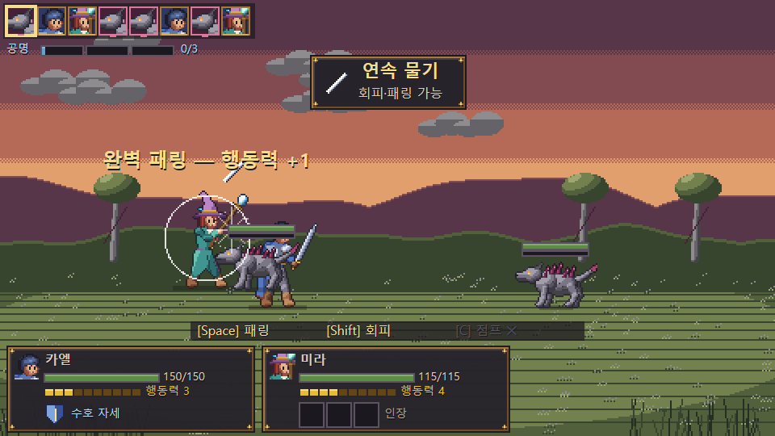

</div>

---

## 목차

- [소개](#소개)
- [스크린샷](#스크린샷)
- [주요 특징](#주요-특징)
- [조작법](#조작법)
- [시작하기](#시작하기)
- [프로젝트 구조](#프로젝트-구조)
- [코드 기반 픽셀아트 파이프라인](#코드-기반-픽셀아트-파이프라인)
- [테스트](#테스트)
- [배포](#배포)
- [알려진 제한 사항](#알려진-제한-사항)

## 소개

세계의 지형과 생명을 잇던 거대한 지하 생명체 **세계뿌리**가 오염되었습니다. 상처에서 자라난 **잔향가시**가 기억과 지형을 뒤섞고 생물을 변이시킵니다.
카엘과 동료들은 세 성소의 수호자를 쓰러뜨리고 **세계 봉인**을 되찾아 세계뿌리 심부로 내려가야 합니다.

```text
타이틀 → 푸른 피난처 → 탐험 → 눈에 보이는 적과 조우 → 반응형 턴제 전투 → 성장
       → 성소 × 3 (수호자 · 세계 봉인) → 세계뿌리 심부 → 3페이즈 최종 보스 → 엔딩 → 승리 화면
```

- 첫 클리어 목표: 약 30~60분 (반복 사냥 없이)
- 브라우저만 있으면 바로 실행되며, 백엔드는 없습니다
- 모든 그래픽은 **코드와 데이터**로, 모든 음악·효과음은 **WebAudio 실시간 합성**으로 만듭니다 (외부 이미지·오디오 파일 없음)

## 스크린샷

| 거점 · 푸른 피난처 | 필드 · 재빛 초원 |
| :---: | :---: |
| 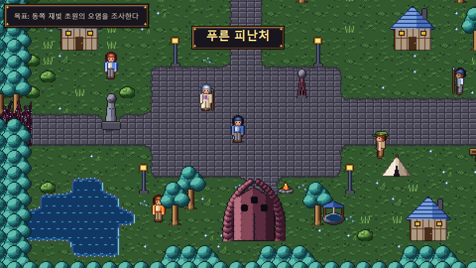 | 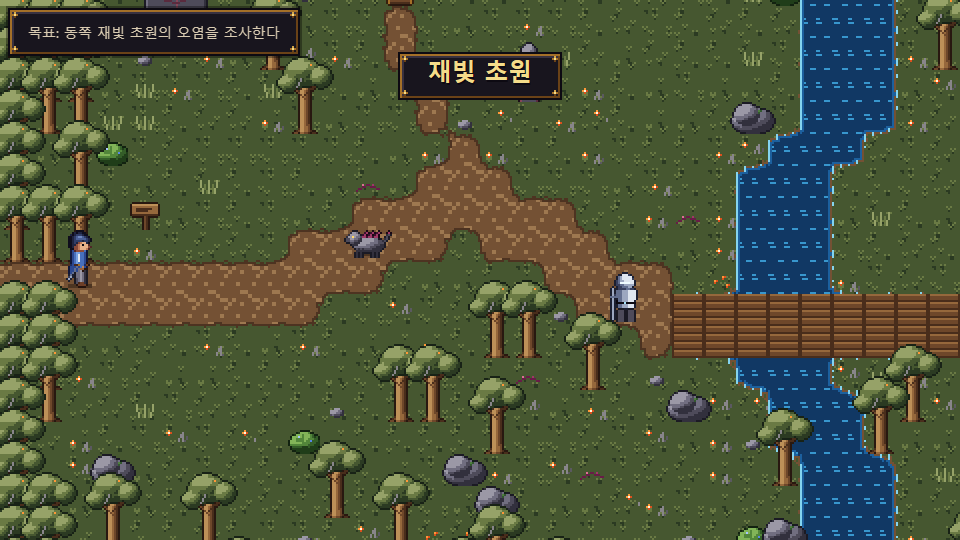 |
| **연속 공격 완전 패링 → 반격** | **붕괴 가능 → 붕괴 발동** |
| 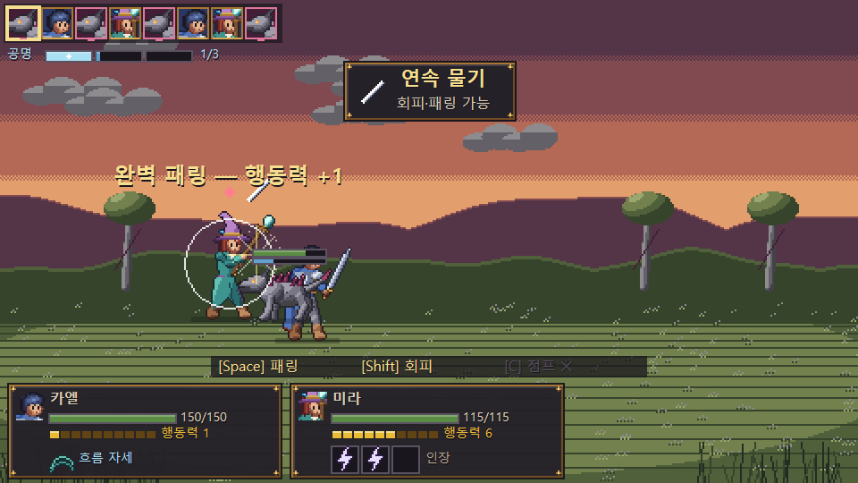 | 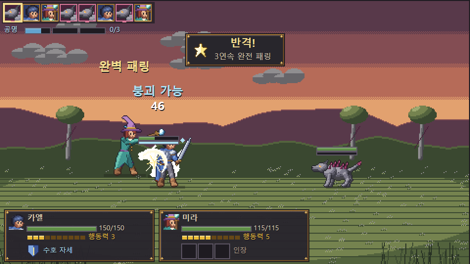 |
| **정밀 조준 (약점 직접 겨냥)** | **수호자 · 유리뿔 사슴왕** |
| 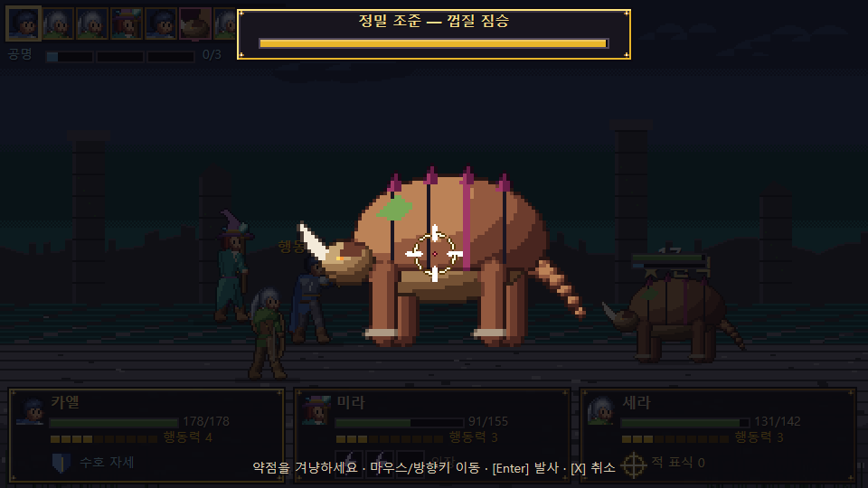 | 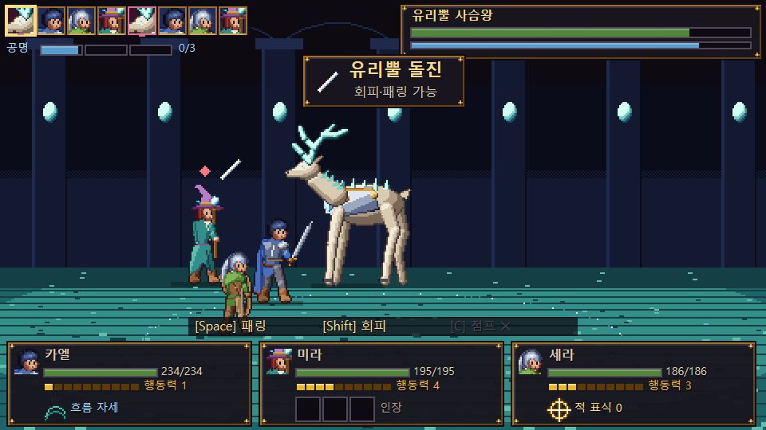 |
| **최종 보스 3페이즈** | **승리 화면** |
| 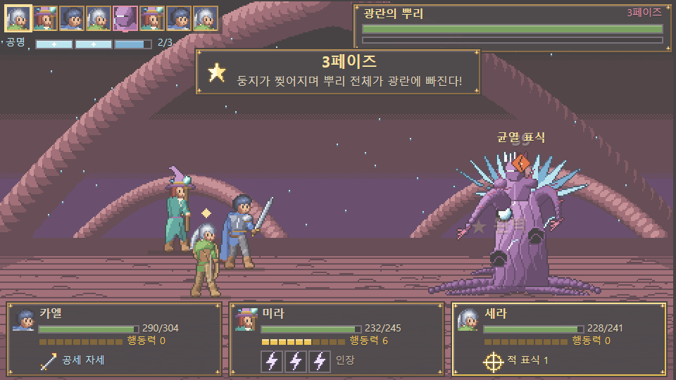 | 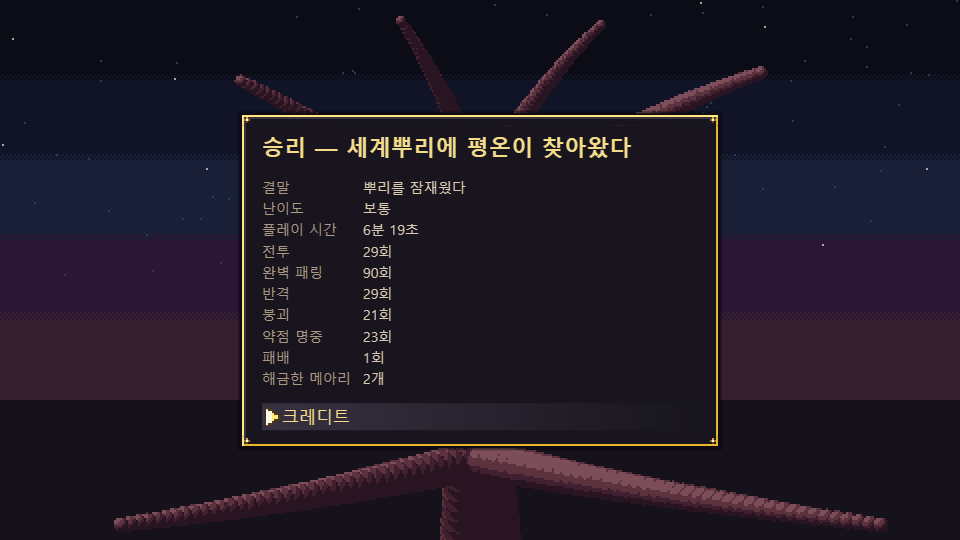 |
| **기술 장착** | **유물 · 숙련** |
| 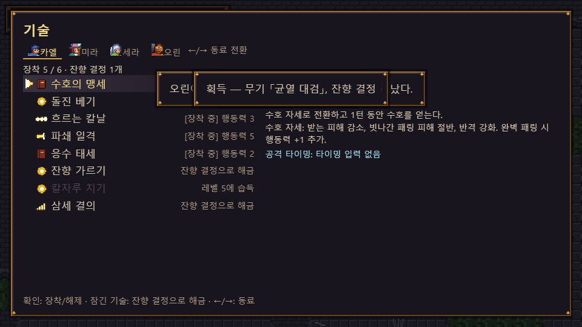 | 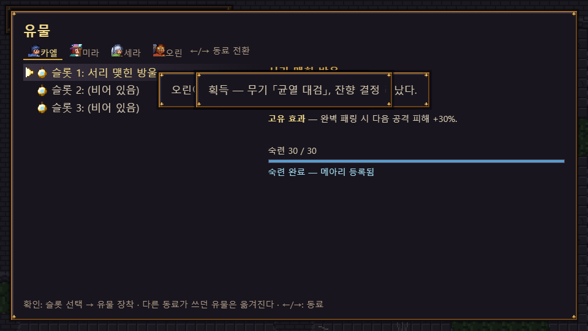 |

## 주요 특징

### ⚔️ 반응형 턴제 전투

| 시스템 | 내용 |
| --- | --- |
| **행동력(AP)** | 동료마다 따로 쌓임 (최대 10, 시작 3, 턴마다 +1). 기본 공격·완벽 패링이 만들고 기술이 소비 |
| **공격 타이밍** | 애니메이션의 실제 접촉 프레임에 맞춘 4가지 입력 — 한 번 / 여러 박자 / 누르고 떼기 / 리듬. 실패·성공·완벽 3단계 (실패해도 약화된 효과로 발동) |
| **회피** | 넓고 안전한 판정, 보상 적음. 패링 불가 공격도 피할 수 있음 |
| **패링** | 좁은 판정, 헛누르면 잠시 잠김. 피해 무효 + 행동력. 한 연속 공격을 모두 패링하면 **반격** |
| **점프 대응** | 충격파·쓸기·지면 균열 같은 지면 공격 전용 |
| **붕괴** | 체력과 별도 게이지. 가득 차면 붕괴 가능 기술로 발동 → 다음 행동 취소, 순서 지연, 받는 피해 증가, 충전 공격 취소 |
| **정밀 조준** | 적 스프라이트를 확대해 실제 약점 좌표를 겨냥. 부위 파괴·패턴 봉쇄·갑주 제거 |
| **공명** | 파티 공유 3칸 — 1칸 구조, 2칸 고유 강력기, 3칸 파티 연계기 |

판정은 **프레임 수가 아니라 입력 이벤트의 고해상도 타임스탬프**로 계산하므로 프레임 드롭이나 고주사율에서도 결과가 같습니다. 판정 폭은 모두 [`src/data/config.ts`](src/data/config.ts) 한 곳에서 관리합니다.

### 🧭 네 명의 동료, 네 가지 자원 순환

| 동료 | 고유 자원 | 운영 |
| --- | --- | --- |
| **카엘** | 자세 (수호 · 공세 · 흐름) | 기술이 자세를 바꾸고, 자세마다 피해·비용·패링 보상이 달라짐 |
| **미라** | 원소 인장 (화염 · 조류 · 폭풍) | 인장을 남기고 조합을 소비 — 화염+조류 = 증기 폭발, 세 원소 = 필살기 |
| **세라** | 표식 (균열 · 추적 · 메아리) | 표식을 쌓고 폭발시켜 붕괴·행동력·광역 피해. 정밀 조준 특화 |
| **오린** | 충전 | 공격·타이밍·동료 반격으로 모으고, 포격·보호막·행동력 지원에 소비 |

### 📈 빌드

- 캐릭터당 기술 **8개**(6개 장착), 플레이 방식을 바꾸는 무기 **2개**, 유물 **14개**
- 유물을 장착하고 싸우면 **숙련**이 오르고, 완료되면 **메아리**로 등록되어 유물을 벗어도 **통찰력** 한도 안에서 효과만 장착
- 최종 빌드 = 무기 + 기술 6개 + 유물 3개 + 메아리 + 파티 조합 + 플레이어의 반응 숙련

### 👹 적과 보스

- 일반 적 아키타입 6종 (가시 사냥개 · 빈 갑주 · 늪의 호명자 · 유리 불꽃 · 뿌리 거상 · 껍질 짐승) + 숨겨진 강적
- 수호자 3명 — **방어 시험**(잿불 파수꾼) · **정밀 시험**(유리뿔 사슴왕) · **빌드 시험**(폭풍의 합창자)
- 최종 보스 **3페이즈** — 잔향의 기사 → 가시 둥지(이동하는 약점) → 광란의 뿌리(긴 연속 공격 · 마지막 붕괴 기회)

### ♿ 난이도와 접근성

- 난이도 3단계 (이야기 · 보통 · 숙련) — 적 체력 배수가 아니라 **판정 폭 · 적 패턴 · 자원 압박 · 보조 표시**가 달라짐
- 화면 흔들림 · 섬광 강도 · 텍스트 속도 · UI 배율(1 / 1.25 / 1.5) · 반응 타이밍 보조 · 공격 타이밍 자동화
- 모든 핵심 입력 **키 재설정** (충돌 시 자동 교환) · 게임패드 · 전체/음악/효과음 개별 볼륨
- 메뉴는 DOM 기반 (키보드 · 마우스 · ARIA 레이블), 중요한 정보는 색과 함께 모양·문구로도 전달

## 조작법

| 동작 | 키보드 | 게임패드 |
| --- | --- | --- |
| 이동 · 메뉴 선택 | `WASD` / 방향키 | 스틱 / 방향패드 |
| 확인 · 조사 · 공격 타이밍 | `Enter` / `Z` | A |
| 취소 | `X` / `Esc` | B |
| 메뉴 (필드) | `Esc` / `Tab` | Start |
| 달리기 (필드) | `Shift` | LT |
| **패링** (적 턴) | `Space` | RB |
| **회피** (적 턴) | `Shift` | LB |
| **점프 대응** (적 턴) | `C` | X |
| 정밀 조준 | 마우스 / 방향키 | 스틱 |

> 키보드 배치는 **설정 → 키 재설정**에서 바꿀 수 있습니다.

## 시작하기

**요구 사항:** Node.js 22.12 이상 (24.13에서 확인), 최신 데스크톱 브라우저

```bash
git clone https://github.com/Legerdo/echobriar.git
cd echobriar
npm install
npm run dev        # 아트 생성 → 검증 → 개발 서버 (http://localhost:5173)
```

Windows에서는 `run.bat`을 더블클릭해도 됩니다 (의존성 설치 후 개발 서버 실행).

| 스크립트 | 설명 |
| --- | --- |
| `npm run dev` | 아트 생성·검증 후 Vite 개발 서버 |
| `npm run build` | 아트 생성·검증 → 타입 검사 → 프로덕션 빌드(`dist/`) |
| `npm run preview` | 빌드 결과 미리보기 |
| `npm run art` | 스프라이트시트·타일셋·배경·매니페스트 생성 + 검증 |
| `npm test` | 단위 테스트 (Vitest) |
| `npm run smoke` | 브라우저 스모크 테스트 (Chrome/Edge 필요) |
| `npm run playtest` | 브라우저 전체 진행 플레이테스트 (타이틀 → 엔딩) |
| `npm run deploy` | 빌드 후 `gh-pages` 브랜치로 GitHub Pages 배포 |
| `npm run verify:live` | 배포된 사이트에서 타이틀 → 새 게임 → 첫 전투를 브라우저로 확인 |

<details>
<summary><b>디버그 기능</b> (일반 플레이에서는 숨김)</summary>

`?debug=1`로 열거나 게임 중 `F9`를 누르면 디버그 패널이 열립니다.

- 무적 · 행동력 +5 · 공명 충전 · 기술·유물·무기 전부 해금 · 은화 +1000
- 조우 건너뛰기 · 보스 구역 즉시 이동 · 저장 초기화
- 충돌 영역 · 약점 히트박스 표시
- **반응 판정 창** — 현재 전투 상태, 적 공격, 경과 시간, 다음 타격 시각, 회피·패링·점프 판정 구간, 실제 입력 시각과 결과

</details>

## 프로젝트 구조

```text
src/
├─ art/            # 코드 기반 픽셀아트 원본 (팔레트·포즈·리그·타일·이펙트·UI)
├─ combat/         # 전투 규칙 — 순수 로직, 렌더링과 분리 (battle · reaction · timing · hits)
├─ data/           # 데이터 주도 콘텐츠 — 수치·판정 폭(config), 캐릭터·기술, 적·보스 패턴, 맵, 스토리
├─ scenes/         # 타이틀 · 필드 · 전투(상태 머신) · 엔딩
├─ ui/             # DOM 메뉴 · 대화 · 설정 · 스타일
├─ state/          # 저장 데이터 · 성장 규칙 · 로컬 저장/검증
├─ audio/          # WebAudio 절차 합성 (음악 7곡 · 효과음)
├─ input/          # 키보드 · 마우스 · 게임패드, 타임스탬프 입력 큐, 키 재설정
├─ gfx/            # 자원 로더 · 정수 배율 렌더링 도우미 · 전투 문구 배치
├─ world/          # 충돌 · 컷신 스크립트 실행기
├─ locale/         # 한국어 로케일 (조사 자동 선택 포함)
└─ debug/          # 숨김 디버그 패널 · 자동 플레이 봇
tools/
├─ artgen/         # 아트 생성기 · 검증기 · 컨택트 시트 · PNG 인코더
├─ playtest/       # Playwright(설치된 Chrome) 브라우저 테스트
└─ deploy/         # GitHub Pages 배포
tests/             # Vitest 단위 테스트
docs/screenshots/  # README 스크린샷 (브라우저 플레이테스트에서 캡처)
Prompt/            # 이 게임의 원본 개발 기획 프롬프트
```

**렌더링:** 논리 해상도 480×270을 정수 배율로 확대하고 최근접 보간을 씁니다. 필드는 16×16 듀얼 그리드 오토타일(가장자리·안쪽/바깥쪽 모서리·전환 포함)을 사용합니다.

**전투 상태 머신:** `BATTLE_START → TURN_SELECT → PLAYER_ACTION → ATTACK_TIMING → ENEMY_TELEGRAPH → ENEMY_REACTION → ENEMY_RESOLUTION → COUNTER → BREAK → TURN_END → VICTORY/DEFEAT` 흐름을 일시정지 가능한 게임 시계 위의 코루틴으로 진행합니다.

## 코드 기반 픽셀아트 파이프라인

아트의 원본은 PNG가 아니라 **코드와 데이터**입니다. 생성된 PNG/JSON은 빌드 산출물(캐시)이며 저장소에 커밋하지 않습니다.

```text
src/art (팔레트 · 신체 비율 · 포즈 블루프린트 · 프레임별 보정 픽셀 · 약점 좌표)
   └─ npm run art:gen   →  public/generated/ (스프라이트시트 · 타일셋 · 배경 · manifest.json)
   └─ npm run art:validate
```

- 전역 팔레트 램프(재질별 3~5단계)와 선택적 외곽선. 자동 그라디언트나 잡음 질감은 쓰지 않습니다
- 전투 스프라이트 96×80 (인간형 약 4.5~5.5등신), 필드 스프라이트 24×32 (약 3등신) — 따로 그린 표현이며 확대본이 아닙니다
- 적 크기별 프레임 (소형 32~56 / 중형 96×80 / 대형 88×96 / 보스 128~144)
- 애니메이션 프레임마다 `anticipation / attack / contact / recovery` 태그가 붙고, **적 공격의 타격 시각은 contact 프레임에서 직접 파생**됩니다
- **검증기**가 프레임 크기, 필수 애니메이션, 투명 배경, 발 앵커 흔들림, 팔레트 밖 색, 약점 좌표(프레임 안 · 실제 픽셀 위), 빈 프레임, 매니페스트 일치를 검사합니다 (88개 시트, 24개 이미지)
- 개발용 컨택트 시트와 실루엣 비교 시트는 `tools/artgen/out/contact/`에 생성됩니다

## 테스트

### 단위 테스트 — 76개 통과

```bash
npm test
```

행동력 획득·소비·상한 · 패링 행동력 상한(무한 루프 방지) · 공격 타이밍 판정 · 회피와 패링 판정 폭 차이 · 연속 공격 완전 패링 → 반격 1회 · 점프 대상 제한 · 붕괴 게이지와 발동 · 타임라인 지연·가속 · 상태 지속과 만료 · 캐릭터 고유 자원 · 유물 숙련과 메아리 해금 · 통찰력 한도 · 저장 왕복과 손상 데이터 처리 · 맵 연결성 · 아트 ↔ 전투 데이터 일치 · 한국어 조사 · 전투 문구 겹침 방지

### 브라우저 전체 진행 플레이테스트

```bash
npm run build && npm run playtest
```

설치된 Chrome에서 실제 빌드를 실행해 **타이틀 → 한국어 튜토리얼 → 첫 전투 승리 → 저장 후 재실행·이어하기 → 패배 화면 → 유물 숙련·메아리 해금 → 정밀 조준 약점 명중 → 수호자 3명 → 세 봉인·최종 구역 개방 → 최종 보스 3페이즈 → 엔딩·승리 화면**까지 진행합니다.

- 긴 이동은 디버그 이동으로 줄이지만 **전투는 자동 승리 없이** 실제 규칙으로 진행합니다
- 봇이 방어·타이밍 입력을 **타임스탬프가 찍힌 실제 입력 경로**로 넣고, 방어의 15%는 일부러 놓칩니다
- 최근 결과: 16개 단계 모두 통과, 전투 29회, 브라우저 오류 0건

## 배포

GitHub Pages는 `gh-pages` 브랜치의 빌드 결과를 그대로 제공합니다.

```bash
npm run deploy     # npm run build → dist/ 를 gh-pages 브랜치로 푸시
```

`vite.config.ts`의 `base: './'` 덕분에 저장소 하위 경로(`/echobriar/`)에서도 그대로 동작합니다.
`gh-pages`는 배포 전용 브랜치이며, 배포할 때마다 빌드 결과 한 커밋으로 덮어씁니다. 배포 뒤 `npm run verify:live`로 실제 사이트를 확인할 수 있습니다.

## 알려진 제한 사항

- 전체 진행 검증은 자동 플레이 봇으로 했습니다. 사람이 직접 플레이한 체감 난이도와 실제 클리어 시간(목표 30~60분)은 아직 측정하지 않았습니다
- 전체 진행 테스트는 **보통** 난이도로만 끝까지 돌렸습니다
- 자동 테스트는 음소거 상태로 실행되며, 게임패드는 실제 기기로 확인하지 않았습니다
- 캔버스 전투 HUD는 화면 낭독기에 실시간 안내 문구만 전달합니다. WCAG 준수 여부는 보조기기를 사용한 수동 테스트와 전문가 검토가 필요합니다
- 라이선스가 아직 지정되지 않았습니다

---

<div align="center">
<sub>모든 그래픽은 코드로 생성되고, 모든 소리는 브라우저에서 합성됩니다.</sub>
</div>
